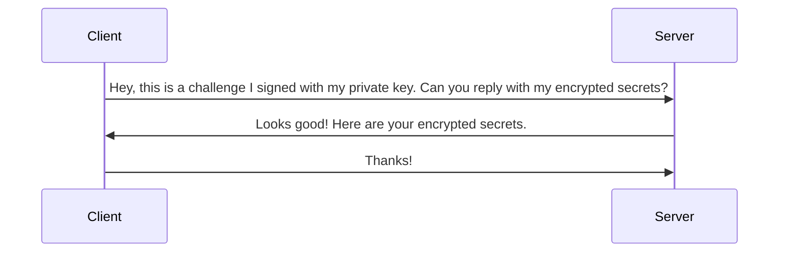

# konbini

A service to manage secrets for your awesome projects. This repository will include a CLI tool to tap into
the service.

Feel free to fork/clone this repository and host the service on your own server.

## Table of Content
- [Database Setup](#database-setup)
- [CLI](#cli)

## Database Setup

Make sure you have PostgreSQL (code works with v14) installed.

After installing POstgreSQL, run the followin commands to create the database and user.

Change user to postgres and connect to database server:
```
sudo -i -u postgres
psql
```

Crate a new database named `konbini`:
```
CREATE DATABASE konbini;
```

Create a new user named `cashier`:
```
CREATE USER cashier WITH PASSWORD 'mypassword';
```

Grant privileges to the user `cashier`:
```
GRANT ALL PRIVILEGES ON DATABASE konbini TO cashier;
```

Now you can run the application and migrations will run automatically.
```
air
```

## CLI

This CLI tool simplifies secure secret management for your projects. It leverages a config file (`.konbini.yml`)
to seamlessly load secrets into a `.env` file by running `konbini buy bento`.
For authentication, it utilizes asymmetric keys (public/private) so there won't be a password and the private key is managed by the user.


### Authentication Flow



The server just rejects the client if the signature failed to verify and not response with the encrypted secrets.
The keyword here is `encrypted`. All secrets are first encrypted on the client side
and then sent to the server to store them. The server will never have raw secrets stored
and during transportation of the secrets as well.
