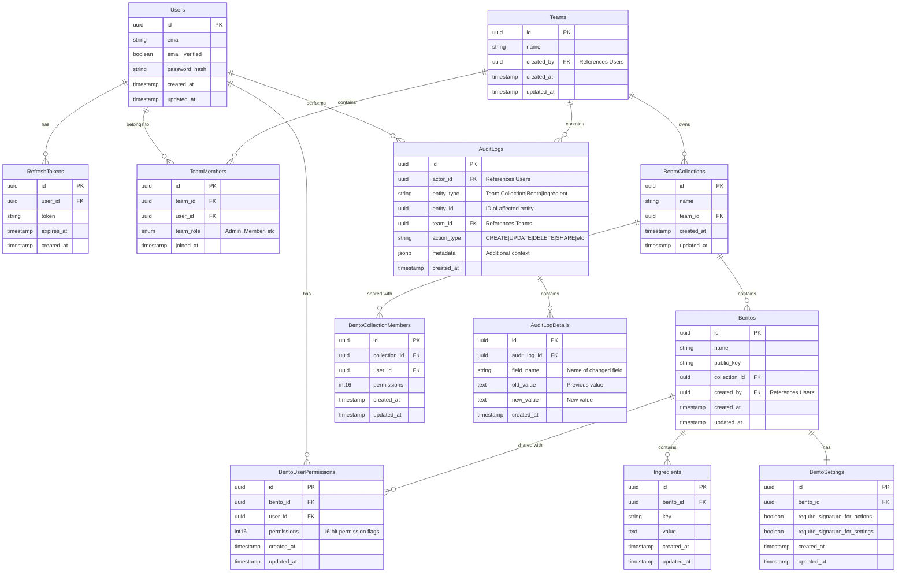

# Database Management
Continue to use PostgreSQL but migrate SQL to use SQLc for type-safe golang code usage. Makes sure that queries are performed correctly against the schema.

```yaml:sqlc.yaml
# this configuration file needs updating
version: "2"
sql:
  - engine: "postgresql"
    queries: "query.sql"
    schema: "db/migrations"
    gen:
      go:
        package: "tutorial"
        out: "tutorial"
```

# Alternative Repository/Service Management
Drop the use of external tools to manage the schema and type-safe code. Use the following project structure to divide repository/store with services (business logic).

```:Project_Strutucre
root/
|_ cmd/
|  |_ api/main.go
|
|_ internal/
   |_ repository/
   |  |_ user_repository.go
   |  |_ other_repository.go
   |
   |_ service/
      |_ user_service.go
      |_ other_service.go
|
|_ common/
   |_ ../..
|
|_ migrations/..
```

Repositories follow an interface to map almost 1:1 with database actions.
Services combine different repositories to complete operations.

```go:Base_Repository_Interface
// Abstract interface, method names must be the same but it can
// accept different parameters to better fit the use case.
type BaseRepository interface {
	Insert(data interface{}) (string, error)
	Delete(id string) error
	Update(id string, data interface{}) error
	Select(id string) (interface{}, error)

	// provide methods to use a transaction
	InsertTx(tx *sql.Tx, data interface{}) (string, error)
	DeleteTx(tx *sql.Tx, id string) error
	UpdateTx(tx *sql.Tx, data interface{}) error
}
```

# Core Features

- Authentication via email + password.
	- make access token last 10 minutes and refresh tokens last 1 week.
- Bento
	- Create
		- A public key should be provided by the client. This key will serve as a way to identify access to the bento through digital signatures.
		- Can associate bento to a team upon creation. Must provide the team id in the request.
	- Update
		- based on bento settings, a digital signature might be required before executing any of these actions.
		- update bento name, ingredients
		- each ingredient can have actions to update and delete.
	- Delete
		- based on bento settings, a digital signature might be required before executing any of these actions.
	- Share bento
		- share bento up to sharing user's permission levels
		- share bento with selected permission levels
	- Un-share bento
		- un-share from someone who was previously shared to
		- un-share from anyone if requesting user has master un-share permission
	- 2 permission layers
		- Individual layer
		- Team layer
		- individual > team
- Bento Settings Layer
	- By default, updating bento settings layer does require a digital signature from owner.
	- Required digital signature for actions.
	- Required digital signature to update bento settings layer.
	- Link to team, provide the team id
- Share access to bentos
	- allow controlling how much access other users have over the shared bento(s)
	- sharing means to allow others to:
		- read ingredients
			- key/value
		- update ingredients
			- key/value
		- delete ingredients
		- update bento's name
		- share bento access to others
			- only up to whatever access they have
			- if you shared to, then you can un-share
		- un-share bento access
			- this is a global un-share permission, allow un-share access to anyone that got shared access to bento
- Using integer representation for permissions, 16-bit, these are bento specific permissions
	- 0000_0000 => read perms, by default whoever that gained access to the private key to unlock the bento gains read access
	- 0000_0001 => share perms
	- 0000_0010 => master un-share perms
	- 0000_0100 => update ingredients perms
	- 0000_1000 => delete ingredients perms
	- 0001_0000 => update bento perms, this permission allow updating the name of the bento and also add ingredients to the bento
	- 0010_0000 => delete bento perms
	- 0100_0000 => undefined
	- 1000_0000 => master key
- Team formation
	- allow the creation of teams
	- teams can have access to a group of bentos
	- teams will all shared the same level of permission
		- individual permission has precedence over team permission
	- team permissions follow the same 16-bit permission layout as described above
	- users must be invited to join a team
	- a user can be in multiple teams
- Audit System
	- track user actions across the system
	- access control to the audit system should only be available to team members.

# Database Schema


# API V1 Documentation

## Base URL
All endpoints are prefixed with: `/api/v1`

## Authentication
All endpoints except `/api/v1/auth/*` and `GET /api/v1/bento` require a valid JWT token in the Authorization header:
`Authorization: Bearer <token>`

### Authentication Endpoints

#### POST /api/v1/auth/register
Register a new user.
```json
Request:
{
  "email": "string",
  "password": "string"
}

Response:
{
  "user": {
    "id": "string",
    "email": "string"
  },
  "access_token": "string",
  "refresh_token": "string"
}
```

#### POST /api/v1/auth/login
Login with email and password.
```json
Request:
{
  "email": "string",
  "password": "string"
}

Response: Same as register
```

#### POST /api/v1/auth/refresh
Refresh access token.
```json
Request:
{
  "refresh_token": "string"
}

Response:
{
  "access_token": "string",
  "refresh_token": "string"
}
```

## Team Management

#### POST /api/v1/teams
Create a new team.
```json
Request:
{
  "name": "string"
}

Response:
{
  "id": "string",
  "name": "string",
  "created_by": "string",
  "created_at": "timestamp"
}
```

#### GET /api/v1/teams
List teams for current user.
```json
Query Parameters:
- page: integer
- limit: integer

Response:
{
  "data": [{
    "id": "string",
    "name": "string",
    "member_count": integer,
    "role": "string"
  }],
  "total": integer
}
```

#### POST /api/v1/teams/{teamId}/members
Invite member to team.
```json
Request:
{
  "email": "string",
  "role": "string" // "admin" or "member"
}

Response:
{
  "id": "string",
  "email": "string",
  "role": "string"
}
```

## Collection Management

#### POST /api/v1/teams/{teamId}/collections
Create a new collection.
```json
Request:
{
  "name": "string"
}

Response:
{
  "id": "string",
  "name": "string",
  "team_id": "string",
  "created_at": "timestamp"
}
```

#### GET /api/v1/teams/{teamId}/collections
List collections in team.
```json
Query Parameters:
- page: integer
- limit: integer

Response:
{
  "data": [{
    "id": "string",
    "name": "string",
    "bento_count": integer
  }],
  "total": integer
}
```

## Bento Management

#### POST /api/v1/teams/{teamId}/collections/{collectionId}/bentos
Create a new bento.
```json
Request:
{
  "name": "string",
  "public_key": "string"
}

Response:
{
  "id": "string",
  "name": "string",
  "public_key": "string",
  "collection_id": "string",
  "created_by": "string",
  "created_at": "timestamp"
}
```

#### GET /api/v1/teams/{teamId}/collections/{collectionId}/bentos/{bentoId}
Get bento
```json
Request:
{
  "signature": "string"
}

Response:
{
  "type": "array",
  "items": {
    "type": "object",
    "key": "string", // key of the env
    "value": "string" // encrypted value
  }
}
```

#### PUT /api/v1/teams/{teamId}/collections/{collectionId}/bentos/{bentoId}/settings
Update bento settings.
```json
Request:
{
  "require_signature_for_actions": boolean,
  "require_signature_for_settings": boolean,
  "signature": "string" // Required if settings require signature
}

Response:
{
  "require_signature_for_actions": boolean,
  "require_signature_for_settings": boolean
}
```

## Ingredient Management

#### POST /api/v1/teams/{teamId}/collections/{collectionId}/bentos/{bentoId}/ingredients
Add ingredient to bento.
```json
Request:
{
  "key": "string",
  "value": "string",
  "signature": "string" // Required if bento requires signature
}

Response:
{
  "id": "string",
  "key": "string",
  "value": "string",
  "created_at": "timestamp"
}
```

#### PUT /api/v1/teams/{teamId}/collections/{collectionId}/bentos/{bentoId}/ingredients
Update ingredient(s).
```json
Request:
[
	{
		"key": "string",
		"value": "string" // Required if changing value is desired.
	}
]

Response:
{
  "count": "number", // Updated count
}
```

#### DELETE /api/v1/teams/{teamId}/collections/{collectionId}/bentos/{bentoId}/ingredients
Update ingredient(s).
```json
Request:
["string"] // List of keys to delete

Response:
{
  "count": "number", // Delete count
}
```


## Sharing Management

#### POST /api/v1/teams/{teamId}/collections/{collectionId}/bentos/{bentoId}/share
Share bento with user.
```json
Request:
{
  "user_email": "string",
  "permissions": integer // 16-bit permission flags
}

Response:
{
  "user_id": "string",
  "permissions": integer
}
```

## Audit Logs

#### GET /api/v1/teams/{teamId}/audit
Get audit logs for team.
```json
Query Parameters:
- start_date: timestamp
- end_date: timestamp
- entity_type: string[]
- action_type: string[]
- page: integer
- limit: integer

Response:
{
  "data": [{
    "id": "string",
    "actor": {
      "id": "string",
      "email": "string"
    },
    "entity_type": "string",
    "entity_id": "string",
    "action_type": "string",
    "metadata": object,
    "created_at": "timestamp",
    "details": [{
      "field_name": "string",
      "old_value": "string",
      "new_value": "string"
    }]
  }],
  "total": integer
}
```

## Common Structures

### Permission Flags (16-bit)
```
0000_0000 => read perms (default with private key)
0000_0001 => share perms
0000_0010 => master un-share perms
0000_0100 => update ingredients perms
0000_1000 => delete ingredients perms
0001_0000 => update bento perms
0010_0000 => delete bento perms
0100_0000 => undefined
1000_0000 => master key
```

### Common HTTP Status Codes
- 200: Success
- 201: Created
- 400: Bad Request
- 401: Unauthorized
- 403: Forbidden
- 404: Not Found
- 409: Conflict
- 500: Internal Server Error

### Common Error Response
```json
{
  "error": "string",
  "message": "string"
}
```

### Common Success Response Wrapper
```json
{
  "data": object | array,
  "message": "string" // Optional success message
}
```

### Pagination Response Format
```json
{
  "data": array,
  "total": integer,
  "page": integer,
  "limit": integer
}
```

### Digital Signatures
- Required for certain operations based on bento settings
- Signed using the bento's public key
- Passed in `signature` field where required

## Important Notes

1. API Versioning:
- All endpoints are prefixed with `/api/v1`
- Future versions will use `/api/v2`, `/api/v3`, etc.
- Version in URL ensures clear API contract

2. Authentication:
- Access tokens expire in 10 minutes
- Refresh tokens expire in 1 week
- All tokens are JWTs

3. Team Permissions:
- Team members can view all logs under their team
- Team roles: admin, member

4. Collection Management:
- Collections belong to one team
- Collections organize bentos

5. Bento Security:
- Each bento has its own public key
- Digital signatures may be required for operations
- Settings control signature requirements

6. Audit Logging:
- All operations are logged
- Logs include actor, action, and changes
- Accessible to all team members

7. Pagination:
- All list endpoints support pagination
- Page numbers start at 1
- Default limit can be configured

```python
epics = {
    "Core Infrastructure": {
        "label": "infrastructure",
        "tasks": [
            {
                "title": "INFRA-1: Set up Go project structure and basic configuration",
                "body": """Tasks:
- Initialize Go project with modules
- Set up configuration management
- Implement logging framework
- Set up development environment""",
                "duration": 1
            },
            {
                "title": "INFRA-2: Set up database and migrations",
                "body": """Tasks:
- Set up PostgreSQL database
- Implement database migration system
- Create initial schema migrations
- Set up database connection pooling""",
                "duration": 1
            },
            {
                "title": "INFRA-3: Implement basic middleware and utilities",
                "body": """Tasks:
- Error handling middleware
- Request logging
- CORS configuration
- Response helpers""",
                "duration": 1
            }
        ]
    },
    "Authentication": {
        "label": "authentication",
        "tasks": [
            {
                "title": "AUTH-1: Implement user registration and login",
                "body": """Tasks:
- User registration endpoint
- Login endpoint
- Password hashing
- Basic validation""",
                "duration": 1
            },
            {
                "title": "AUTH-2: Implement JWT authentication",
                "body": """Tasks:
- JWT token generation
- Access token implementation
- Refresh token implementation
- Token validation middleware""",
                "duration": 1
            },
            {
                "title": "AUTH-3: Implement auth middleware and user context",
                "body": """Tasks:
- Authentication middleware
- User context management
- Token refresh endpoint
- Logout functionality""",
                "duration": 1
            }
        ]
    },
    "Team Management": {
        "label": "team",
        "tasks": [
            {
                "title": "TEAM-1: Implement team creation and management",
                "body": """Tasks:
- Create team endpoint
- Update team endpoint
- List teams endpoint
- Team deletion with cascading""",
                "duration": 1
            },
            {
                "title": "TEAM-2: Implement team membership",
                "body": """Tasks:
- Add team member endpoint
- Update member roles
- Remove team member
- List team members""",
                "duration": 1
            },
            {
                "title": "TEAM-3: Implement team permissions and validation",
                "body": """Tasks:
- Team role enforcement
- Permission validation
- Team access middleware
- Team member validation""",
                "duration": 1
            }
        ]
    },
    "Collection Management": {
        "label": "collection",
        "tasks": [
            {
                "title": "COLL-1: Implement collection CRUD",
                "body": """Tasks:
- Create collection endpoint
- Update collection endpoint
- List collections
- Delete collection""",
                "duration": 1
            },
            {
                "title": "COLL-2: Implement collection permissions",
                "body": """Tasks:
- Collection access control
- Team-collection relationship
- Collection validation middleware
- Collection metrics""",
                "duration": 1
            }
        ]
    },
    "Bento Core": {
        "label": "bento",
        "tasks": [
            {
                "title": "BENTO-1: Implement bento CRUD operations",
                "body": """Tasks:
- Create bento endpoint
- Update bento endpoint
- List bentos
- Delete bento""",
                "duration": 1
            },
            {
                "title": "BENTO-2: Implement bento settings",
                "body": """Tasks:
- Bento settings management
- Digital signature validation
- Settings update endpoint
- Settings enforcement""",
                "duration": 1
            },
            {
                "title": "BENTO-3: Implement ingredients management",
                "body": """Tasks:
- Add ingredient endpoint
- Update ingredient endpoint
- Delete ingredient endpoint
- Ingredient validation""",
                "duration": 1
            },
            {
                "title": "BENTO-4: Implement sharing system",
                "body": """Tasks:
- Share bento endpoint
- Update share permissions
- Remove share access
- Share validation""",
                "duration": 1
            }
        ]
    },
    "Audit System": {
        "label": "audit",
        "tasks": [
            {
                "title": "AUDIT-1: Implement audit logging",
                "body": """Tasks:
- Audit log creation
- Audit detail logging
- Entity tracking
- Action tracking""",
                "duration": 1
            },
            {
                "title": "AUDIT-2: Implement audit querying",
                "body": """Tasks:
- Audit log retrieval
- Filtering implementation
- Pagination
- Team-based access control""",
                "duration": 1
            }
        ]
    },
    "Security & Performance": {
        "label": "security",
        "tasks": [
            {
                "title": "SEC-1: Implement digital signature system",
                "body": """Tasks:
- Signature validation
- Key management
- Signature middleware
- Error handling""",
                "duration": 1
            },
            {
                "title": "SEC-2: Security hardening",
                "body": """Tasks:
- Input validation
- Rate limiting
- Security headers
- Error sanitization""",
                "duration": 1
            },
            {
                "title": "PERF-1: Performance optimization",
                "body": """Tasks:
- Database indexing
- Query optimization
- Caching strategy
- Connection pooling""",
                "duration": 1
            }
        ]
    },
    "Testing & Documentation": {
        "label": "testing",
        "tasks": [
            {
                "title": "TEST-1: Implement unit tests",
                "body": """Tasks:
- Core functionality tests
- Middleware tests
- Utility tests
- Mock implementations""",
                "duration": 1
            },
            {
                "title": "TEST-2: Implement integration tests",
                "body": """Tasks:
- API endpoint tests
- Database tests
- Authentication tests
- End-to-end flows""",
                "duration": 1
            },
            {
                "title": "DOC-1: API documentation and deployment guide",
                "body": """Tasks:
- API documentation
- Deployment procedures
- Configuration guide
- Getting started guide""",
                "duration": 1
            }
        ]
    },
    "Frontend Basics": {
        "label": "frontend",
        "tasks": [
            {
                "title": "UI-1: Set up frontend project",
                "body": """Tasks:
- Project initialization
- Basic routing
- API client setup
- Authentication flow""",
                "duration": 1
            },
            {
                "title": "UI-2: Implement core UI components",
                "body": """Tasks:
- Login/Register forms
- Team management UI
- Basic layouts
- Error handling""",
                "duration": 1
            }
        ]
    }
}
```
